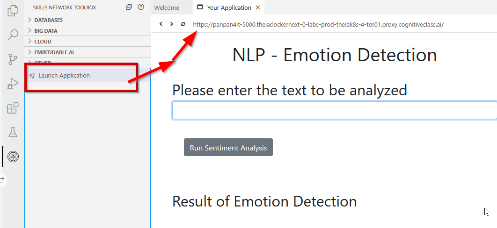

# Завдання 6: Веб-розгортання програми з використанням Flask

Після успішного завершення всіх тестів потрібно розгорнути програму у вебі, щоб замовник міг отримати до неї доступ і використовувати її.

> **Примітка:**  
> Файл `index.html` у папці `templates` і файл `mywebscript.js` у папці `static` уже надані в репозиторії. Їх змінювати не потрібно.

---

## Вимоги до реалізації

1. Створіть файл:

```text
server.py
````

з нуля.

> **Примітка:** `server.py` має знаходитися в папці `final_project`.

2. Використайте Flask для створення веб-застосунку.

3. Flask route для функції аналізу повинен мати шлях:

```text
/emotionDetector
```

4. Застосунок має працювати на:

```text
localhost:5000
```

---

## Формат відповіді

Для вхідного тексту:

```text
I love my life.
```

приклад JSON-відповіді:

```json
{
  "anger": 0.006274985,
  "disgust": 0.0025598293,
  "fear": 0.009251528,
  "joy": 0.9680386,
  "sadness": 0.049744144,
  "dominant_emotion": "joy"
}
```

Веб-відповідь повинна відображатися у такому форматі:

```text
For the given statement, the system response is 'anger': 0.006274985, 'disgust': 0.0025598293, 'fear': 0.009251528, 'joy': 0.9680386 and 'sadness': 0.049744144. The dominant emotion is joy.
```

---

## Оцінювання

### Варіант 1 — AI Graded Submission and Evaluation

### Activity 1

Скопіюйте код із файлу `server.py`, який демонструє Flask web deployment.

Збережіть у текстовий файл:

```text
6a_server
```

для фінального submission.

---

### Activity 2

Запустіть застосунок і протестуйте його з фразою:

```text
I think I am having fun
```

Зробіть скріншот розгорнутого застосунку та збережіть як:

```text
6b_deployment_test.png
```

> Цей файл потрібен і для AI grading, і для peer grading.

---

## Варіант 2 — Peer-Graded Submission and Evaluation

### Activity 1

Зробіть скріншот фінального вмісту `server.py` та збережіть як:

```text
6a_server.png
```

### Activity 2

Збережіть скріншот deployment result як:

```text
6b_deployment_test.png
```

---

## Підсумок submission

Для Task 6 потрібно підготувати:

```text
6a_server
6b_deployment_test.png
```

---

## Додатково

За бажанням ви можете у будь-який момент відправити код у свій forked GitHub repository.
